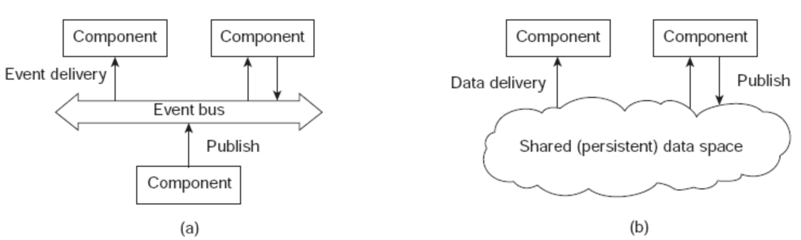

<html><head><meta content="text/html; charset=UTF-8" http-equiv="content-type"></head><body class="c55">
A system to generate speech to text in real time

Kavyashree Shankar

Illinois Institute of Technology

Chicago, US

kshankar1@hawk.iit.edu

Saptarshi Chatterjee

Illinois Institute of Technology

Chicago, US

schatterjee@hawk.iit.edu

Abstract&mdash;&nbsp;A real time speech to text conversion system &nbsp;converts the spoken words into text . Speech-to-Text technology enables us to convert audio to text by applying powerful neural network models. It has number of applications for users with and without disabilities. Speech-to-text has been used for voice search, help writers boost their productivity, and to provide alternate access to a computer for individuals with physical impairments. Other applications include speech recognition for foreign language learning, voice activated products for the blind and many familiar mainstream technologies. It is a driving force behind the success of new age voice-controlled speakers like Amazon Echo&nbsp;and Google Home.

While cloud solutions like Google Cloud Speech-to-Text, Amazon Transcribe, IBM watson Speech to Text etc effectively convert audio and voice into written text , but there are some scalability challenges in effectively using them. &nbsp;In this project we tried to address some of those challenges and also tested what are the configurations and parameters yield best results for such a system.

Keywords&mdash; Speech-to-Text, voice search, Amazon Echo, Google Home

<h1 class="c49">1. Introduction.</h1><h1 class="c49">&nbsp;&nbsp;&nbsp;&nbsp;&nbsp;&nbsp;&nbsp;&nbsp;In this article we are proposing a scalable system architecture to generate text from speech input in real time. We also are publishing our experiment results and performance metrics for different technologies used as the building blocks of &nbsp;this architecture.</h1>

<h1 class="c40">2. Related Work, Challenges And How We Addressed These Issues.</h1>

A lot of work is already been done in this field. Cloud services became fairly good at converting audio and voice into written text using Machine Learning Algorithm like Neural Network , but still such a system has scalability challenges in effectively using them. Following are the few challenges that drives most of the architecture decisions while designing such a system - 

<ol class="c24 lst-kix_oxgbu9l7gq5h-0 start" start="1"><li class="c16 c30 c31"><h2 style="display:inline">Selection of scalable system design patterns.</h2></li></ol>

If we push streaming audio directly to web server, then such a system is bound to choke under heavy load, as CPU will be busy processing previous inputs and new inputs will be waiting to be consumed and eventually system will start throwing 5XX errors . So we need to provisionally store the audio file , before an available process can pick it up and start processing . 

We researched on several Scalable System Design Patterns[2]&nbsp;and found out &quot; event-based architecture&quot; model is most suitable to address this problem .Event-based architecture supports several communication styles:
<ul class="c24 lst-kix_i0yxwfnohpzj-0 start"><li class="c19 c30 c31">Publish-subscribe</li><li class="c38 c30 c31">Broadcast</li><li class="c30 c31 c38">Point-to-point</li></ul>
Publish-subscribe communication style decouples sender &amp; receiver and facilitates asynchronous communication. &nbsp;Event-driven architecture (EDA) promotes the production, detection, consumption of, and reaction to events[3].

The main advantage of this architecture is that they are loosely coupled.

So for this Application we are pushing the audio files to a distributed queue (Kafka ) &nbsp;and a multithreaded Spring Boot Application &nbsp;consumes those Audio files from the queue.

<h2 class="c16 c36 c53" id="h.4pshgdd1zsmd"></h2><h2 class="c16 c36" id="h.dais2shkvkcp">B. Selection of storage platform for provisional storage of &nbsp;audio file.</h2>

We need to store the audio file in a DataBase / Storage system before a consumer picks that up and starts processing . Audio files need to be stored as BLOB data . We looked at several DataBases and found NoSql database like MongoDB performs better at storing BLOB data compared to traditional RDBMS systems[4].

However, we found that storing the Audio files in MongoDB will not be a good choice , because -
<ol class="c24 lst-kix_lrhuxtcsa0ea-0 start" start="1"><li class="c19 c30 c31">&nbsp;Maximum document size supported is 16MB and large sound files can easily exceed that range .</li><li class="c19 c30 c31">&nbsp;If we store the audio in MongoDB , then consumer application need to constantly poll the db to check if there is a new file. If we increase the polling frequency then this new event detection is &nbsp;instantaneous, but it increases the system workload. So there is a tradeoff between workload and &nbsp;response time.</li></ol>
So , we decided to use Kafka as provisional storage platform&nbsp;for Audio files. Kafka performs drastically faster than other point-to-point messaging platform like Activemq or Rabbitmq[5].

<h2 class="c16 c36"></h2><h2 class="c16 c20 c53"></h2><h2 class="c16 c20">C. Storing Large files in Kafka</h2>

Kafka was initially designed as Distributed Messaging System for Log Processing. So default max message size ~ 1MB . A &gt; 10 Sec 1 channel .wav file easily exceeds 1MB in size. So we need to override default configs in order to support large messages. Following properties had to be changed to support this. These values are in bytes , hence out system could easily handle ~40MB message.

<h1 class="c39"></h1><h2 class="c16 c20 c53" id="h.10h82q30m4us"></h2><h2 class="c16 c20" id="h.ucml5ov3dsds">D. Multithreaded kafka consumer</h2>

Multiple producers push to kafka in a multi-partition topic, it&rsquo;s obvious that we also need a multi-threaded consumer to keep the whole thing robust and balanced . Previous work has been done in this topic[6]&nbsp;to implement a multithreaded Kafka consumer using Kafka-Python .But &nbsp;kafka-python is not thread safe&nbsp;and does not support multi-threading. 

To overcome this challenge we decided to use Spring-kafka&nbsp;along with out multithreaded Spring Boot application, which is thread safe and graciously supports multithreading.
<h1 class="c40" id="h.7po38jmns3kw"></h1><h1 class="c40 c44"></h1><h1 class="c40" id="h.oj6s0tk7cbv2">3. Technologies Used in System Implementation </h1>

<ol class="c24 lst-kix_vlkl5h3s9tuc-0 start" start="1"><li class="c18">Apache Kafka&nbsp;- Apache Kafka&reg; is a distributed streaming platform.</li></ol>

<ol class="c24 lst-kix_vlkl5h3s9tuc-0" start="2"><li class="c18">MongoDB&nbsp;- MongoDB is an open-source, document database designed for ease of development and scaling. </li></ol>

<ol class="c24 lst-kix_vlkl5h3s9tuc-0" start="3"><li class="c18">Google cloud to Speech&nbsp;- Powerful speech recognition cloud service that enables developers to convert audio to text by applying powerful neural network models in an easy-to-use API. </li></ol>

<ol class="c24 lst-kix_vlkl5h3s9tuc-0" start="4"><li class="c18">Spring Boot&nbsp;- Spring Boot is a Spring framework module which provides RAD (Rapid Application Development) feature to the Spring framework.</li></ol>

<ol class="c24 lst-kix_vlkl5h3s9tuc-0" start="5"><li class="c18">Sockets&nbsp;- a JavaScript library for real time web applications. It enables real time, bi-directional communication between web clients and servers. </li></ol>

<ol class="c24 lst-kix_vlkl5h3s9tuc-0" start="6"><li class="c18">HTML5 Web Audio API&nbsp;- The Web Audio API provides a powerful and versatile system for controlling audio on the Web, allowing developers to choose audio sources, add effects to audio, create audio visualizations, apply spatial effects (such as panning) and much more.</li></ol><h1 class="c40 c44" id="h.er2a05b26jpf"></h1><h1 class="c40" id="h.q2g0bwxefig6">4. Proposed System Architecture and Design</h1>

<ol class="c24 lst-kix_an6kjhfesdzw-0 start" start="1"><li class="c18">We are using HTML5 MediaStream Recording API to record the audio inside a browser environment</li></ol>

<ol class="c24 lst-kix_an6kjhfesdzw-0" start="2"><li class="c18">Posting the Audio as BLOB data using Ajax to a Spring Boot application running on Tomcat Server &nbsp;</li></ol>

<ol class="c24 lst-kix_an6kjhfesdzw-0" start="3"><li class="c18">&nbsp;A Spring controller receives the Audio data and pushes it to Kafka topic &nbsp;recieved_sound</li></ol>

D. A kafka Consumer receives an event that new audio is available and it consumes the audio and stream that audio to Google Speech-To-Text &nbsp;api. And when transcript is available pushes it to topic &lsquo;transcriptToClient&rsquo;.

E. A service method calls to google Speech-To-Text api to get the transcript from google.

&nbsp;

F. When the transcript is available in &lsquo;transcriptToClient&rsquo; topic a consumer picks it up and stores it in &nbsp;MongoDB for future reference. it also pushes the transcript to a open socket&nbsp;connection initiated by client.

G. Client who is listening on an open socket receives the transcript and &nbsp;displays it in the browser

5. Results and their analysis.

<h2 class="c16" id="h.i048tc24o0s0">A.Comparison of cloud services to generate text from speech </h2>

We tried out &nbsp;Google Cloud Speech-to-Text, Amazon Transcribe, IBM watson Speech to Text for our experiment . We found Google Cloud Speech-to-Text performs the best compared to other too . Error rate and latency time is both significantly lower for google &nbsp; Speech-to-Text. Avg. Latency time is 6sec for &lt; 1MB&nbsp;files.

<h5 class="c40"></h5><h2 class="c16" id="h.h4v6fhb9cu25">B. System load testing </h2><h2 class="c16" id="h.i71ri1v0gq6z">We tested our system &nbsp;with multiple parallel client request and a dual partition kafka topic with 2 brokers . And received following metrics in a macOs Mojave (MacBook Pro 2017 , 2.3 GHz Intel Core i5 , 8 GB 2133 MHz LPDDR3 )</h2><h5 class="c47">Producer</h5>

Consumer

<h2 class="c42" id="h.xbwj6ioucpc9">C. Audio Encodings </h2><h2 class="c42" id="h.7ijx9f7mxkzr">We recorded mono sound (1 channel ) and noticed recording 2 channels &nbsp;double the file size. We used FLAC encoding , LINEAR16 and MULAW&nbsp;encoding separately&nbsp;with .wav file format . FLAC&nbsp;and &nbsp;LINEAR16&nbsp;performs best with almost error free output when used for Text generation . </h2>
FLAC and LINEAR16 are lossless encoding compared to &nbsp;MULAW . 

<a class="c2" href="https://www.google.com/url?q=https://en.wikipedia.org/wiki/%25CE%259C-law_algorithm&amp;sa=D&amp;ust=1543968574721000">MULAW</a>&nbsp;is an 8 bit PCM encoding, where the sample&#39;s amplitude is modulated logarithmically rather than linearly. As a result, uLaw reduces the effective dynamic range of the audio thus compressed.

So a higher error rate was expected for MULAW.

6. Demo Link.

<a class="c2" href="https://www.google.com/url?q=https://www.youtube.com/watch?v%3D4fz2eoAz8P8%26t%3D6s&amp;sa=D&amp;ust=1543968574722000">https://www.youtube.com/watch?v=4fz2eoAz8P8&amp;t=6s</a>

7. Source Code.

https://github.com/sap9433/SpeechToText

References

[1] Yadav, Devender. &quot;Save Large Files in MongoDB Using Kundera - DZone Database.&quot; Dzone.com. July 24, 2016. Accessed December 01, 2018.https://dzone.com/articles/save-large-files-in-mongodb-using-kundera.

[2] Ho, Ricky. &quot;Scalable System Design Patterns - DZone Database.&quot; Dzone.com. October 18, 2010. Accessed December 01, 2018. https://dzone.com/articles/scalable-system-design

[3] Distributed Systems Architecture . Accessed November 14, 2018. http://cse.csusb.edu/tongyu/courses/cs660/notes/distarch.php..

[4] Kamil Kolonko, &ldquo;Performance comparison of the most popular relational &amp; non-relational database management systems&rdquo; IEEE http://www.diva-portal.org/smash/get/diva2:1199667/FULLTEXT02

[5] Jay Kreps,Neha Narkhede, Jun Rao, &ldquo;Kafka: a Distributed Messaging System for Log Processing&rdquo;. Accessed November 14, 2018. ACM 978-1-4503-0652-2/11/06 http://notes.stephenholiday.com/Kafka.pdf

[6] Guy Shilo, &ldquo;Moving binary data with Kafka &ndash; a more realistic scenario&rdquo;. Accessed November 14, 2018. http://www.idata.co.il/2017 /12/moving-binary-data-with-kafka-a-more-realistic-scenario/

[7] Nodar MOMTSELIDZE, &ldquo;Apache Kafka - Real-time Data Processing&rdquo;. Accessed November 14, 2018. https://jtst.ibsu.edu.ge/jms/index.php/jtst/article/view/80

</body></html>